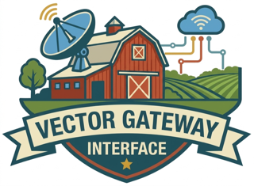

<p align="center">
  
</p>

<p align="center"><em>A <a href="https://query.farm">Query.Farm</a> VGI worker for DuckDB.</em></p>

# vgi-barcode

A [VGI](https://query.farm) worker (Rust, a compiled binary) that brings
**barcode and QR-code decoding and generation** to DuckDB / SQL over Apache
Arrow. DuckDB launches the worker and talks to it over Arrow IPC; the functions
appear under the catalog `barcode`, schema `main`.

Decoding and encoding are powered by [`rxing`](https://crates.io/crates/rxing),
the maintained Rust port of [ZXing](https://github.com/zxing/zxing).

```sql
LOAD vgi;
ATTACH 'barcode' (TYPE vgi, LOCATION './target/release/barcode-worker');
SET search_path = 'barcode.main';

-- Decode the first barcode in an image BLOB.
SELECT decode_barcode(content) AS text,
       barcode_format(content) AS format
FROM read_blob('label.png');
-- → 'vgi-barcode', 'QR_CODE'

-- Generate a QR-code PNG, then round-trip it.
SELECT decode_barcode(generate_qr('hi'));        -- → 'hi'

-- Generate an EAN-13 barcode PNG.
SELECT generate_barcode('5901234123457', 'EAN_13');

-- Every barcode found in one image (table function).
SELECT * FROM decode_barcodes(generate_qr('multi'));
-- seq | format  | text
--   0 | QR_CODE | multi

-- Discover the supported formats.
SELECT * FROM barcode_formats();
```

## Functions

### Scalar

| Function | Returns | Description |
| --- | --- | --- |
| `decode_barcode(blob)` | `VARCHAR` | Text of the first barcode found, or `NULL`. |
| `barcode_format(blob)` | `VARCHAR` | Format name of the first barcode (e.g. `QR_CODE`, `EAN_13`), or `NULL`. |
| `generate_qr(text)` | `BLOB` | QR-code PNG (default 256 px square). |
| `generate_qr(text, size_px)` | `BLOB` | QR-code PNG of the given size. |
| `generate_barcode(text, format)` | `BLOB` | PNG of `text` in `format` (default size). |
| `generate_barcode(text, format, size_px)` | `BLOB` | PNG of the given size. |
| `barcode_version()` | `VARCHAR` | Worker version string. |

### Table

| Function | Columns | Description |
| --- | --- | --- |
| `decode_barcodes(blob)` | `seq BIGINT, format VARCHAR, text VARCHAR` | Every barcode detected in one image (multi-decode). |
| `barcode_formats()` | `format VARCHAR` | The supported barcode format names. |

> DuckDB table functions take **constant** arguments (no subqueries), so the
> image BLOB passed to `decode_barcodes` must be a constant-foldable expression
> (a literal, or e.g. `generate_qr('…')`).

## Supported formats

Decode (multi-format): QR codes, EAN-8/13, UPC-A/E, Code 128/39/93, Codabar,
ITF, Data Matrix, PDF417, Aztec. Generation accepts the same canonical names
(`SELECT * FROM barcode_formats()`); 1D symbologies impose their own payload
constraints (e.g. EAN-13 needs 13 digits), and an unsupported format name is a
clear error.

## Behavior & robustness

Image bytes are treated as **untrusted**:

* A malformed, truncated, or hostile image **never** crashes the worker — it
  decodes to `NULL` (scalars) or no rows (`decode_barcodes`). A bad blob beside a
  good one still produces results.
* Decoding is **bounded**: images whose dimensions or pixel count exceed safe
  limits are rejected at the header stage, before pixels are materialized, so an
  "image bomb" cannot exhaust memory.
* `NULL` input → `NULL` output / no rows.
* On generation, an invalid format name (or a payload that cannot be encoded in
  the requested symbology) surfaces a clear DuckDB error.

## Building & testing

```sh
cargo build --release                                   # build the worker
cargo test --workspace --all-features                   # unit + integration tests
cargo clippy --all-targets --all-features -- -D warnings # lint
make test-sql                                           # DuckDB SQL end-to-end
```

`make test-sql` builds the release worker, points `VGI_BARCODE_WORKER` at it, and
runs the [`haybarn-unittest`](https://pypi.org/project/haybarn-unittest/)
sqllogictest suite under `test/sql/`. Install the runner once with
`uv tool install haybarn-unittest`. Regenerate the committed fixture images with
`make fixtures`.

## License

MIT — see [LICENSE](LICENSE).

---

## Authorship & License

Written by [Query.Farm](https://query.farm) — every VGI worker is designed and built by Query.Farm.

Copyright 2026 Query Farm LLC - https://query.farm

